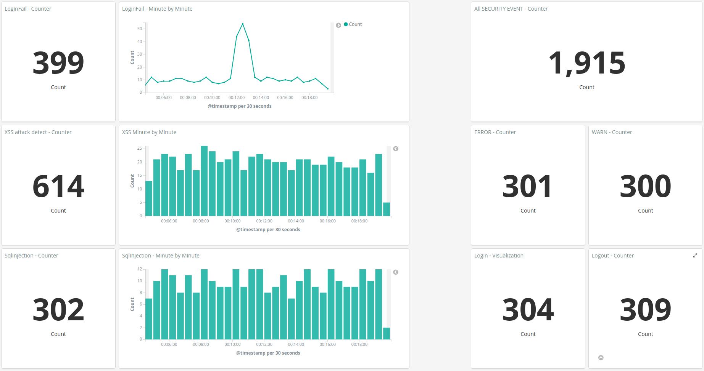
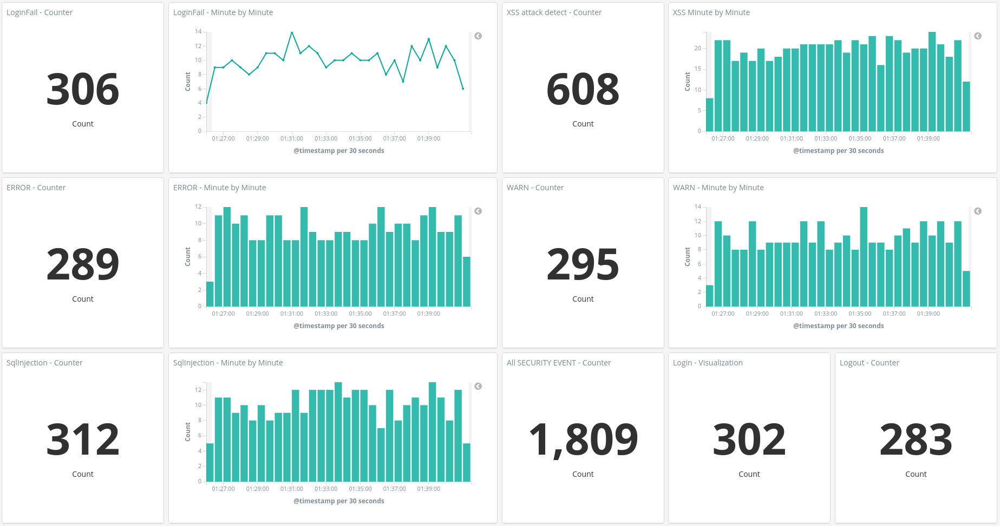

# How to run

- goto: docker folder
- run: ./up.sh

# How to setup Kibana dashboard
- run: attack simulator 
- goto: http://localhost:5601/
- login: elastic / changeme
- goto Kibana -> Management -> Index Patterns
- Create index pattern: 
    - Index pattern: logstash-*
    - Time Filter field name: @timestamp
- goto Kibana -> Management -> Saved Objects
    - Import: kibana_config/export.json

# Attack Simulator
- goto: attack folder
- ./simulator.py

# Example Dashboard

# Example Dashboard

